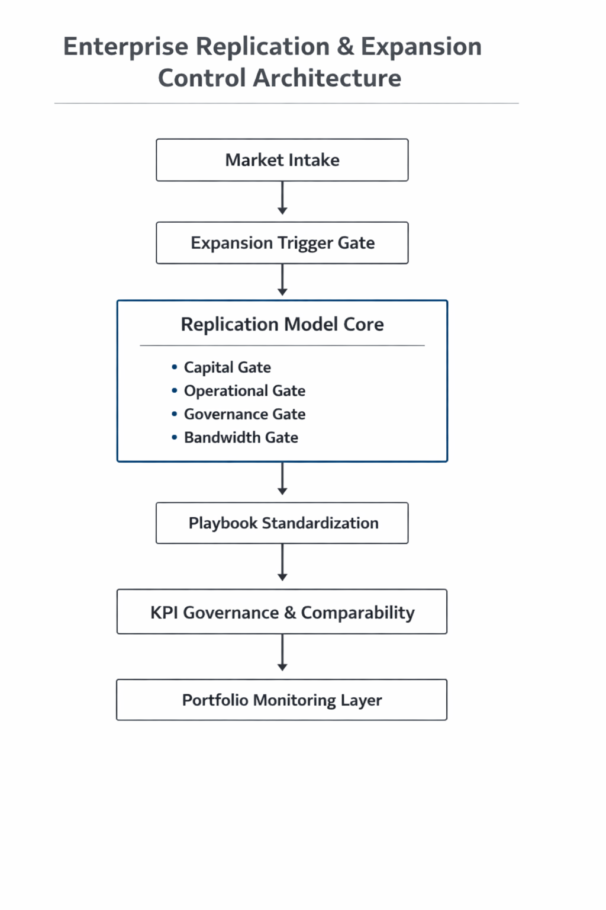
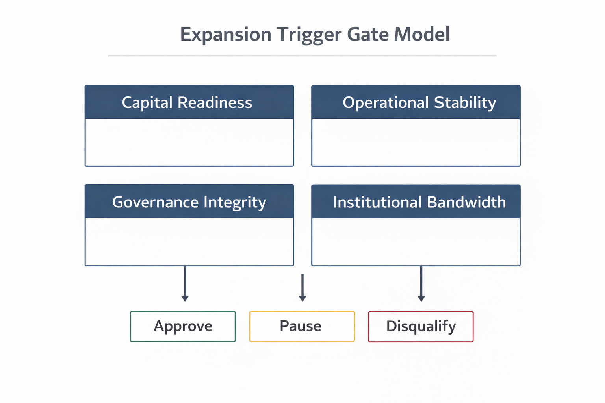

# Multi-Location Replication Engine
**Enterprise Replication + Governance + Expansion Trigger Architecture**

---

## Executive Summary

Multi-market expansion without standardization compounds variance and erodes capital predictability.

This repository documents a replication engine built to convert expansion from opportunity-driven growth into **constraint-governed scalability**—aligning operating playbooks, harmonizing KPIs, enforcing governance discipline, and formalizing market qualification and expansion triggers.

The result is an institutional operating system designed to scale locations **without scaling chaos**.

---

## Operating Philosophy: Why the Replication Roadmap Exists

Growth alone does not create scale.

Scale happens when execution becomes:
- **consistent** (repeatable behavior),
- **measurable** (comparable signals),
- **enforceable** (variance triggers intervention),
- **governed** (risk is managed before it expands),
- **capacity-aware** (expansion pacing respects institutional bandwidth).

In multi-location environments, the natural outcome of expansion is variance:
- Different leaders interpret KPIs differently.
- Local optimization undermines enterprise comparability.
- Compliance and licensing drift becomes a hidden expansion tax.
- Expansion speed outpaces oversight capacity.
- Forecast accuracy degrades as complexity grows.

The roadmap exists to solve one problem:

**How do you expand aggressively without expanding volatility?**

The answer is not more oversight.
The answer is engineered consistency.

---

## Enterprise Replication Architecture

This diagram shows how the operating system connects end-to-end—from expansion gating to portfolio variance control.

**Core artifacts that implement the architecture:**
- Replication model + expansion gating: **[Replication Model — Expansion Trigger Logic](replication_model/expansion_trigger_logic.md)**
- Playbook behavior standardization: **[Operating Playbook Architecture](playbook/sop_framework.md)**
- Authority and ownership clarity: **[Role Clarity Matrix](playbook/role_clarity_matrix.md)**
- KPI governance control system: **[KPI Governance Architecture](kpi_governance/metric_standardization_model.md)**
- Cross-market normalization: **[Regional Comparability Framework](kpi_governance/regional_comparability.md)**

---

## Expansion Trigger Gate Model

Expansion was treated as **capital allocation**, not geographic growth.

Markets advanced only when readiness cleared across:
- capital stability,
- operational stability,
- governance integrity,
- institutional bandwidth.

**Read the full mechanism here:**
- **[Expansion Trigger Logic (Full)](replication_model/expansion_trigger_logic.md)**

---

## Replication Model: What “Repeatability” Actually Means

Replication is not copying tasks.

Replication is institutionalizing outcomes.

The model standardizes:
- **decision points** (what must be consistent),
- **authority boundaries** (who can decide what),
- **operating rhythm** (cadence that prevents drift),
- **governance enforcement** (risk managed before it scales),
- **control signals** (KPI bands + escalation trigger intervention),
- **expansion throttle** (capacity-aware pacing).

This converts scaling from personality-dependent execution into system-dependent execution.

**Artifacts:**
- **[Replication Model — Expansion Trigger Logic](replication_model/expansion_trigger_logic.md)**
- **[Operating Playbook Architecture](playbook/sop_framework.md)**
- **[Role Clarity & Authority Architecture](playbook/role_clarity_matrix.md)**

---

## KPI Governance: Turning Measurement Into Control

KPI governance was not built for reporting alignment.

It was built for **volatility compression**.

Standardization without enforcement produces dashboards.
Enforcement produces enterprise control.

KPI governance connects:
- metric definitions → tolerance bands → escalation triggers → intervention → variance compression.

**Artifacts:**
- **[KPI Governance Architecture](kpi_governance/metric_standardization_model.md)**
- **[Regional Comparability Framework](kpi_governance/regional_comparability.md)**

---

## Regional Comparability: Preventing False Winners and False Losers

Comparability is not “same KPI names.”

Comparability is engineering apples-to-apples performance interpretation so leadership can distinguish:
- market-driven variance vs execution-driven variance,
- structural advantage vs operational discipline,
- real performance vs accounting distortion.

Regional comparability reduces capital misallocation risk by preventing:
- structurally advantaged markets from being mistaken for high execution,
- structurally constrained markets from being punished despite strong discipline.

**Artifact:**
- **[Regional Comparability Framework](kpi_governance/regional_comparability.md)**

---

## Operating Playbook: Behavioral Standardization at Scale

The playbook is not an SOP binder.

It is the behavioral system that prevents drift by standardizing:
- operating rhythm,
- escalation pathways,
- tooling expectations,
- launch stabilization sequence,
- decision rights,
- performance review cadence.

**Artifacts:**
- **[Operating Playbook Architecture](playbook/sop_framework.md)**
- **[Role Clarity Matrix](playbook/role_clarity_matrix.md)**

---

## Evidence Layer: How the System Behaved (Not Just What It Claimed)

This repository includes an analysis layer showing:
- baseline portfolio variance,
- post-standardization spread compression,
- intervention cadence and mechanism,
- expansion gating discipline,
- governance decisions logged as institutional memory,
- bandwidth constraints that cap safe scaling velocity.

**Impact & analysis artifacts:**
- **[Replication Impact Analysis](analysis/replication_impact_analysis.md)**
- **[Variance Intervention Case Study](analysis/variance_intervention_case.md)**
- **[Playbook Rollout Sequence](analysis/playbook_rollout_sequence.md)**
- **[Market Scoring Model](analysis/market_scoring_model.md)**

**Governance & capital discipline artifacts:**
- **[Decision Log Snapshot](analysis/decision_log_snapshot.md)**
- **[Capital Variance Exposure Model](analysis/capital_variance_model.md)**
- **[Institutional Bandwidth Constraint Model](analysis/institutional_bandwidth_limit.md)**

---

## Strategic Takeaway

Expansion becomes scalable when it is filtered through constraints.

This replication engine ensures:
- performance variance is detectable early,
- intervention happens before capital erosion,
- compliance risk is addressed before it scales,
- and expansion pacing respects institutional bandwidth.

Scalability is not achieved by opening more markets.

Scalability is achieved when opening more markets does not degrade control.

---
